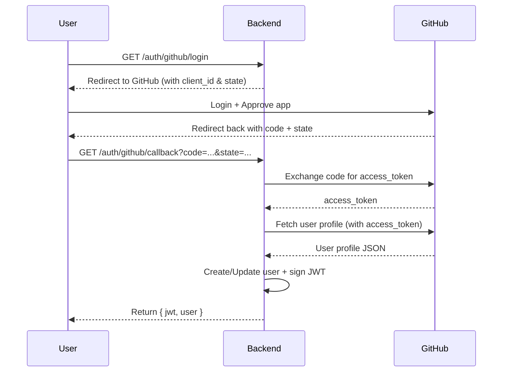

# GitHub OAuth + JWT-Secured WebSocket Chat

## Project Overview
This project implements:

- **Part A:** GitHub OAuth 2.0 Authorization Code Flow
- **Part B:** JWT-Secured WebSocket Chat (Socket.IO)

This project is built with Node.js + Express + Socket.IO. There are no high-level OAuth libraries (like Passport.js) used here. Everything is implemented manually for full control.

---
## Project Setup

### 1. Clone Repository & Install Dependencies
```bash
npm install
```

2. Configure Environmental Variables
First up create a .env file in the project root containing: 

# GitHub OAuth App credentials
GITHUB_CLIENT_ID=your_client_id
GITHUB_CLIENT_SECRET=your_client_secret
GITHUB_CALLBACK_URL=http://localhost:3000/auth/github/callback

# JWT settings
JWT_SECRET=your_super_secure_secret_key
JWT_EXPIRY=1h

# Server
PORT=3000

### Quick Tip:
Incases where you would love to create a secure secret key use: 
```bash
 node -e "console.log(require('crypto').randomBytes(64).toString('hex'))"
```
This commandline is to be pasted in your terminal and you would also see your secure secret key provide in your terminal too.


3. Starting the Server
```bash
npm run dev
```

After running the above code, server will run on https://localhost:3000


# PART A : GITHUB OAuth FLOW 2.0 
1. LOGIN WITH GITHUB

### Open Browser 
http://localhost:3000/auth/github/login

This redirects you to github's oauth page after login approval, github redirects you back to your callback


2. CALLBACK RESPONSE
After success a backend exchanges the code for the github access token to get the User's Profile.

You will see something like this:
```json
{
  "jwt": "eyJhbGciOi...",
  "user": {
    "id": "github:12345",
    "login": "yourusername",
    "name": "Your Name",
    "avatar": "https://..."
  }
}
```

3. PROTECTED ENDPOINT: /me 
### Test with curl using:
```bash
curl -H "Authorization: Bearer YOUR_JWT" http://localhost:3000/me
```

### Your expected response is: 
```json
{
  "user": {
    "id": "github:12345",
    "login": "yourusername",
    "name": "Your Name",
    "avatar": "https://..."
  }
}
```


# PART B :  JWT-SECURED WEBSOCKET CHAT (Socket.IO)
1. CONNECT WITH SOCKET.IO CLIENT
### Example: Client.js
```js

const { io } = require("socket.io-client");

const token = "PASTE_YOUR_JWT_HERE";
const socket = io("http://localhost:3000", { auth: { token } });

socket.on("connect", () => {
  console.log("Connected as:", socket.id);
  socket.emit("join", { room: "general" });
  socket.emit("message", { room: "general", text: "Hello from client!" });
});

socket.on("message", (msg) => console.log("💬", msg));
socket.on("notification", (note) => console.log("🔔", note));
```

### To run it use: 
```bash
node client.js
```

2. EXPECTED CHAT BEHAVIOUR
#### ON 'join' EVERYONE IN THE ROOM GETS A NOTIFICATION

#### ON 'message' ALL USERS IN THE ROOM RECEIVE THE CHAT MESSAGE 

#### ON DISCONNECT SERVER LOGS THE EVENT


OAUTH FLOW SEQUENCE DIAGRAM



WEBSOCKET AUTH DIAGRAM
```mermaid
sequenceDiagram
  participant Client
  participant Server

  Client->>Server: WebSocket connect (auth: { token })
  Server->>Server: Verify JWT with secret
  alt valid token
    Server-->>Client: Connection established
    Client->>Server: join { room }
    Server-->>Room: Broadcast join notification
    Client->>Server: message { room, text }
    Server-->>Room: Broadcast message
  else invalid token
    Server-->>Client: Connection rejected (unauthorized)
  end
 ```
